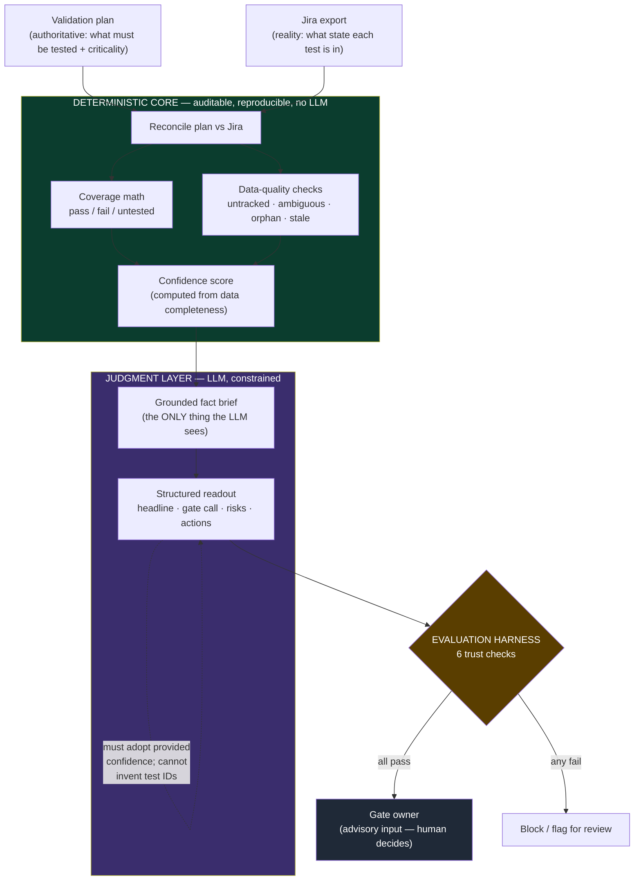

# Evaluation Framework — Trustworthy AI for the Validation Copilot

> The question a PMO asks before adopting any AI tool isn't "is it clever?" — it's
> **"how do we know we can trust what it tells us, and what happens when it's wrong?"**
> This document is the answer for the validation copilot: the trust architecture, the
> metrics, the harness that measures them, and the governance around the output.

---

## 1. Why this matters (the PMO lens)

This tool influences a **phase-gate decision** — real money and schedule. An AI that
is *usually* right but occasionally invents a passing result, hides a failing one, or
sounds confident on incomplete data is worse than no tool at all, because it launders
a bad decision in authoritative language.

So adoption isn't gated on the demo looking good. It's gated on **measured evidence**
across the dimensions below, plus explicit guardrails for the failure cases.

## 2. The trust architecture: two layers, one boundary

The single most important design decision is *where the AI is allowed to operate*.



**The boundary:** all numbers and classifications are computed in plain Python — they
are deterministic, reproducible, and auditable. The LLM never computes a number; it
only receives a grounded fact brief and turns it into judgment and language. This
collapses the LLM's hallucination surface from "anything" to "the wording of a readout
built from pre-verified facts."

## 3. What we measure

Each dimension maps to a recognized trustworthy-AI property, and each is checked
automatically by `evals/eval_harness.py` against labeled scenarios with known answers.

| # | Dimension | Trustworthy-AI property | How it's measured | Target |
|---|-----------|-------------------------|-------------------|--------|
| 1 | **Determinism** | Reproducibility / auditability | Coverage math + data-quality buckets match a known-correct golden result | 100% |
| 2 | **Decision accuracy** | Correctness | `gate_recommendation` matches the expected go / conditional-go / no-go | 100% |
| 3 | **Confidence calibration** | Calibrated uncertainty | Reported `confidence` equals the data-completeness-derived level (no false certainty) | 100% |
| 4 | **Grounding (no fabrication)** | Faithfulness / hallucination control | Every test ID in the readout traces to the plan or Jira; zero invented IDs | 0 fabricated |
| 5 | **Critical recall** | Completeness (catch the costly error) | Every critical-not-passing item appears in the readout | 100% |
| 6 | **Hygiene recall** | Completeness | Every untracked / ambiguous / orphan ticket is flagged | 100% |

**Why recall over precision here:** in a gate decision the expensive error is the
*missed* critical risk, not an extra flag. The metrics are weighted to make a silent
drop a hard failure.

## 4. Confidence calibration (the "how confident are we" answer)

Confidence is **computed from data completeness, not guessed** — and the LLM is
instructed to adopt it verbatim, never inflate it:

| Level | When |
|---|---|
| **low** | coverage < 80%, or any required test untracked, or any ambiguous (closed-no-result) ticket |
| **medium** | coverage 80–95%, or stale in-flight tickets |
| **high** | ≥ 95% coverage, all tracked, all confirmed |

This is the guardrail against the most dangerous AI failure mode in a PMO setting:
*a confident "go" built on incomplete data.* You literally cannot get a HIGH-confidence
readout when a third of the plan is untested.

## 5. The harness & current results

Runs **offline** (rule-based, no API key) for free CI, or **`--llm`** to score the
real model output:

```bash
python evals/eval_harness.py          # offline
python evals/eval_harness.py --llm    # score Claude's output
```

Scenarios live in `evals/scenarios/` — each is a plan + Jira export + `expected.json`
with the known-correct answer. They deliberately span the decision space:

| Scenario | Designed to test | Expected |
|---|---|---|
| `01_critical_failures` | failures + every data-quality defect | NO-GO, LOW |
| `02_clean_release` | the happy path | GO, HIGH |
| `03_coverage_gap` | incomplete-but-not-broken | CONDITIONAL-GO, MEDIUM |

**Current result: 18 / 18 checks pass — both offline and against the live model.**
That the LLM passes *grounding* and *confidence calibration* is the key evidence: the
model is operating inside the guardrails, not around them.

## 6. Governance & limitations

- **Advisory, not authoritative.** The readout is an input to the gate owner, who
  signs off. The flowchart ends at a human for a reason.
- **Fail-closed.** If any eval check fails, the output is flagged for review rather
  than shipped — the harness exit code can gate CI/CD.
- **Honest about scope.** This validates *structure and grounding*, not semantic
  nuance. Next steps to harden it: an **LLM-as-judge** rubric for narrative quality,
  a larger labeled scenario bank, adversarial/red-team inputs (contradictory Jira
  states, malformed exports), and tracking decision accuracy against real historical
  gate outcomes.
- **Data honesty.** Coverage is only as good as the inputs — which is exactly why the
  tool surfaces untracked and ambiguous tickets loudly instead of treating silence
  as a pass.

---

*All scenario data is synthetic and for demonstration only.*
