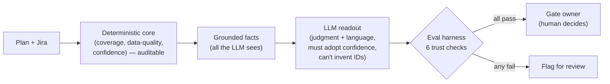

# Post-Silicon Validation Copilot 🔬

> Turn a validation plan + bench logs into a gate-review readout: coverage,
> risk call, and a prioritized, ownable action list.

<p align="center">
  
</p>

When you're bringing a mixed-signal part to production, the hard question before
every phase gate is simple to ask and painful to answer: **are we actually
covered, and what's still at risk?** The data is usually scattered across a test
plan and a pile of bench logs. This copilot stitches them together and produces
the readout a program manager would walk into a gate review with.

## What it does

1. **Computes coverage deterministically in Python** — planned vs. executed,
   pass rate, failures, skips, untested gaps, and critical items not yet passing.
   The numbers are auditable and reproducible; no LLM guessing on the math.
2. **Uses Claude for judgment** — turns those trustworthy facts into an executive
   readout: a one-line headline, a go / conditional-go / no-go call, the top
   risks, and a prioritized action list with suggested owners.

This split is the whole point: machines should do the arithmetic, the LLM should
do the prioritization and communication. That's also how a good PM thinks.

## Why it matters

Generic "chat with your CSV" demos can't make a release call — they don't know
what *critical* means in silicon, or that a skipped jitter test and a failed
bandgap trim are not the same kind of risk. This encodes that judgment.

## Run it in 60 seconds (no API key needed)

The copilot has an **offline mode** (`--no-llm`) that produces the full readout with
a transparent rule-based engine — so you can run the whole thing with zero setup:

```bash
cd post-silicon-validation-copilot
pip install -r requirements.txt
python copilot.py --jira sample_data/jira_export.csv --no-llm --report readout.md
```

That reconciles the sample Jira board against the plan, prints the gate readout, and
writes a shareable `readout.md`. No key, no cost.

### Prefer clicking? Launch the UI

A local web app wraps the exact same engine — pick your data, click **Run**, and the
gate call, confidence, KPI donut charts, coverage bars, risks, actions, and
data-quality flags pop up in the browser. A second tab runs the evaluation harness
with one click. Three built-in sample sources let you see the full decision space by
clicking: **Sample Jira board** (→ NO-GO, with hygiene flags), **Sample clean release**
(→ GO / HIGH), and **Sample bench logs** (clean lab data, no Jira layer).

```bash
pip install -r requirements.txt
python app.py        # then open http://127.0.0.1:5000
```

The UI uses **Flask** (pure Python) so it installs everywhere, including Windows on ARM.
It calls `copilot.py` directly — no analysis logic is duplicated, so the numbers on
screen are the same auditable numbers the CLI and harness produce.

### Then add Claude for the polished narrative

```bash
cp .env.example .env        # paste your ANTHROPIC_API_KEY (see below to get one)
python copilot.py --jira sample_data/jira_export.csv
```

With a key, Claude writes the headline, risk call, and prioritized actions instead of
the rule-based engine. (See **Getting an Anthropic API key** at the bottom.)

Bring your own data with `--plan` and `--logs`:

```bash
python copilot.py --plan my_plan.csv --logs my_bench_logs.csv
```

### Reconcile against Jira (the realistic mode)

In real programs, "what did we test" lives in **Jira**, not a tidy bench log — and
Jira is never 100%. Point the copilot at a Jira CSV export and it reconciles the
board against the authoritative plan, **and flags where Jira can't be trusted**:

```bash
python copilot.py --plan sample_data/validation_plan.csv --jira sample_data/jira_export.csv
```

On top of the normal coverage call, it surfaces three tracking-hygiene problems
that quietly sink real release decisions:

- **Untracked** — a required test that never made it onto the Jira board at all.
- **Ambiguous** — a ticket closed as *Done* with no recorded test result (closed ≠ passed).
- **Orphan** — a ticket in Jira that isn't in the validation plan (scope drift).

The design judgment: a ticket marked *Done* but with no result is **not** counted as
covered. Treating "Done" as "passed" is exactly how teams ship on unverified coverage.

> Map the Jira column names to your board in `jira_adapter.py` (`COL` dict) — the
> defaults match a standard Jira CSV export with `Test ID` / `Test Result` custom fields.

### Input format

**Validation plan** (`validation_plan.csv`): `test_id, category, description, priority`
(`priority` ∈ `critical | high | medium`).

**Bench logs** (`bench_logs.csv`): `test_id, status, notes, date`
(`status` ∈ `pass | fail | skip`). A planned `test_id` with no log row counts as
*untested*.

## Sample output

With the included synthetic data (20 planned tests, 14 logged):

```
======================================================================
POST-SILICON VALIDATION READOUT
======================================================================

Silicon is functionally healthy but not release-ready: two critical
audio/trim items are failing and a third of the plan is unexecuted.

Gate recommendation: NO-GO
Coverage: 65.0%   Pass rate: 76.9%   Critical items not passing: 2

... narrative, top risks, and a P0/P1/P2 action list with owners ...
```

> The deterministic coverage layer is verified by the math above
> (65% coverage, 76.9% pass rate, critical gaps VP-003 & VP-017). The narrative
> layer calls Claude (`claude-opus-4-8` by default; override with `COPILOT_MODEL`).

## All options

| Flag | What it does |
|---|---|
| `--plan PATH` | Validation plan CSV (the authoritative list of required tests) |
| `--logs PATH` | Bench-log CSV (used when `--jira` is not given) |
| `--jira PATH` | Jira CSV export; reconcile against the plan and flag tracking gaps |
| `--no-llm` | Skip Claude; produce a rule-based readout (no API key needed) |
| `--report PATH` | Also write the readout as a shareable Markdown file |
| `--stale-days N` | Flag in-flight Jira tickets not updated in N days (default 14) |

Beyond coverage and the Jira data-quality checks, the readout also includes
**coverage by category** (which areas are weak — e.g. ESD and Trim at 0% in the
sample) and **stale-ticket detection** (in-flight tickets nobody has touched).

## How do we know it's trustworthy? (evaluation)

The hard question for any AI that influences a real decision: **how do we know it's
right, and what happens when it's wrong?** This project ships an evaluation harness
that answers it — see **[EVALUATION.md](EVALUATION.md)** for the full framework.

The trust architecture keeps the LLM inside a tight boundary:



The harness scores the readout on six dimensions — **determinism, decision accuracy,
confidence calibration, grounding (no fabricated IDs), critical recall, and hygiene
recall** — against labeled scenarios with known-correct answers:

```bash
python evals/eval_harness.py          # offline, no API key, free
python evals/eval_harness.py --llm    # score the real Claude output
```

**Current result: 18/18 checks pass — both offline and against the live model.** The
tool also reports a **calibrated confidence** (high/medium/low) computed from data
completeness, so it can never claim high confidence on an incomplete picture.

## How it's built

- `copilot.py` — coverage analysis (pure Python) + the Claude readout layer + the
  offline rule-based readout and Markdown report writer
- `jira_adapter.py` — parses a Jira CSV export and reconciles it against the plan,
  flagging untracked / ambiguous / orphan / stale tickets
- `config.py` — model id + client construction (swap models in one place)
- `evals/` — the evaluation harness + labeled scenarios (see [EVALUATION.md](EVALUATION.md))
- `sample_data/` — synthetic plan, bench logs, and a Jira export
- Structured output via the Anthropic SDK's `messages.parse()` with a Pydantic
  schema, so the readout is always valid, typed data — never free-form text to parse.

## AI techniques shown

RAG-style fact grounding · structured output (Pydantic schema) · the
deterministic-core / LLM-judgment split · calibrated confidence · domain-specific
system prompting · a rule-based fallback so the tool degrades gracefully without a
model · an **evaluation harness** scoring grounding, accuracy, and recall against
labeled scenarios (trustworthy-AI).

## Getting an Anthropic API key

You only need this for the Claude-written narrative — the tool runs fully without it
via `--no-llm`. To get one:

1. Go to **https://console.anthropic.com/** and sign up (or log in).
2. Add a payment method under **Billing** and a small amount of credit (a run of this
   tool costs a fraction of a cent).
3. Open **API Keys** → **Create Key**, name it, and copy the `sk-ant-...` value
   (you only see it once).
4. In this folder: `cp .env.example .env`, then paste the key after
   `ANTHROPIC_API_KEY=` in the `.env` file. The `.env` is gitignored, so it never
   gets committed.

> ⚠️ Sample data is **synthetic** and for demonstration only. It contains no
> proprietary or confidential information from any employer.
